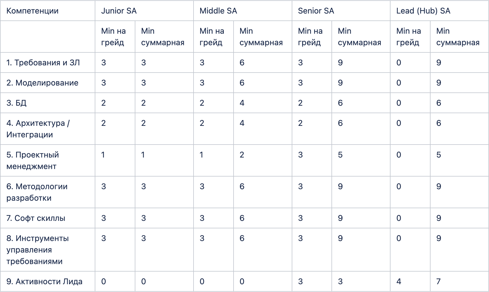

# Профили системных аналитиков

В данной статье содержится информация о позиции Системный аналитик (СА рус. /SA eng.) в Bereke Bank.

Сообщество системных аналитиков в Береке банке называется Клан системных аналитиков.
Клан делится на хабы.
Хаб (Hub) — это группировка системных аналитиков по предметной области, обычно не более 10 человек.

### Базовые ожидания

Ожидается, что все СА, независимо от уровня, обладают:

1. Системное и структурированное мышление, анализ и синтез.
2. Развитые коммуникативные навыки.
3. Способность делать из сложного простое: просто объяснять и предлагать простые решения.
  

### Грейды (уровни)

Junior SA → Middle SA →  Senior SA →  Lead Hub SA → Head of CCSA  

### Краткое описание грейдов

**Junior SA (Младший СА):** "Под присмотром" ментора работает в команде разработки, над пользовательскими историями низкого уровня сложности. Создает и поддерживает в актуальном состоянии документацию.

**Middle SA (СА):** Самостоятельно работает в команде разработки, над пользовательскими историями. Создает и поддерживает в актуальном состоянии документацию.

**Senior SA (Старший СА):** Работает в команде разработки над эпиками, фичами, пользовательскими историями. Создает и поддерживает в актуальном состоянии документацию. Менторит новых аналитиков.

**Lead Hub SA (Лидер хаба СА):** 70% времени работает в команде разработки над эпиками, фичами, пользовательскими историями. Создает и поддерживает в актуальном состоянии документацию.
30% времени работает над развитием хаба. Менторит новых аналитиков. Проводит технические собеседования и технические ревью. Выращивает лидов новых хабов.

**Head of CCSA (Руководитель центра компетенций СА):** Работает над развитием всего клана аналитиков.
  

### Группы компетенций SA

1. Требования и заинтересованные лица.
2. Моделирование
3. Базы данных
4. Архитектура / Интеграции
5. Проектный менеджмент
6. Методологии разработки
7. Софт скиллы
8. Инструменты управления требованиями
9. Активности Лида

При приеме на работу/в проект происходит техническое собеседование, где оценивается уровень компетенций по группам с оценками от 0 до 5:
(0 - СА ничего не слышал о компетенциях раздела, ..., 5 - СА не только использует компетенции в работе, но и может обучать других СА).

По результатам пишется индивидуальный план развития. В период от 9 до 12 месяцев происходит тех.ревью, где заново оценивается уровень компетенций по группам.
  
**Базовая линия компетенций по грейдам**

  

### Необходимые условия переходов между грейдами

**Junior SA -> Middle SA**

Компетенции соответствуют Middle SA.\
Оценка 360 (удовлетворенность команды и ПО) положительная.

**Middle SA -> Senior SA**

Компетенции соответствуют Senior SA.\
Оценка 360 (удовлетворенность команды и ПО) положительная.

**Senior SA -> Lead Hub SA**

Компетенции соответствуют Lead SA.\
Оценка 360 (удовлетворенность команды и ПО) положительная.\
Существуют условия для создания нового хаба.\
Согласование кандидата Head of CCSA.

**Hub Lead SA -> Head of CCSA**

Существуют условия для позиции.\
Согласование кандидата менеджментом.
