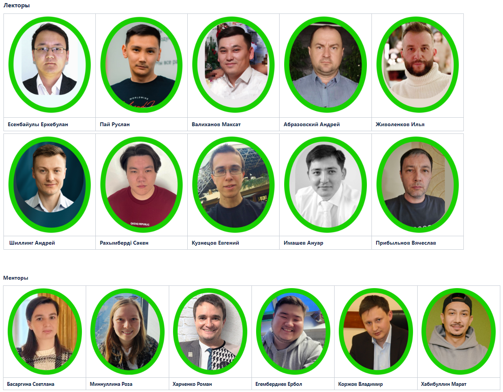
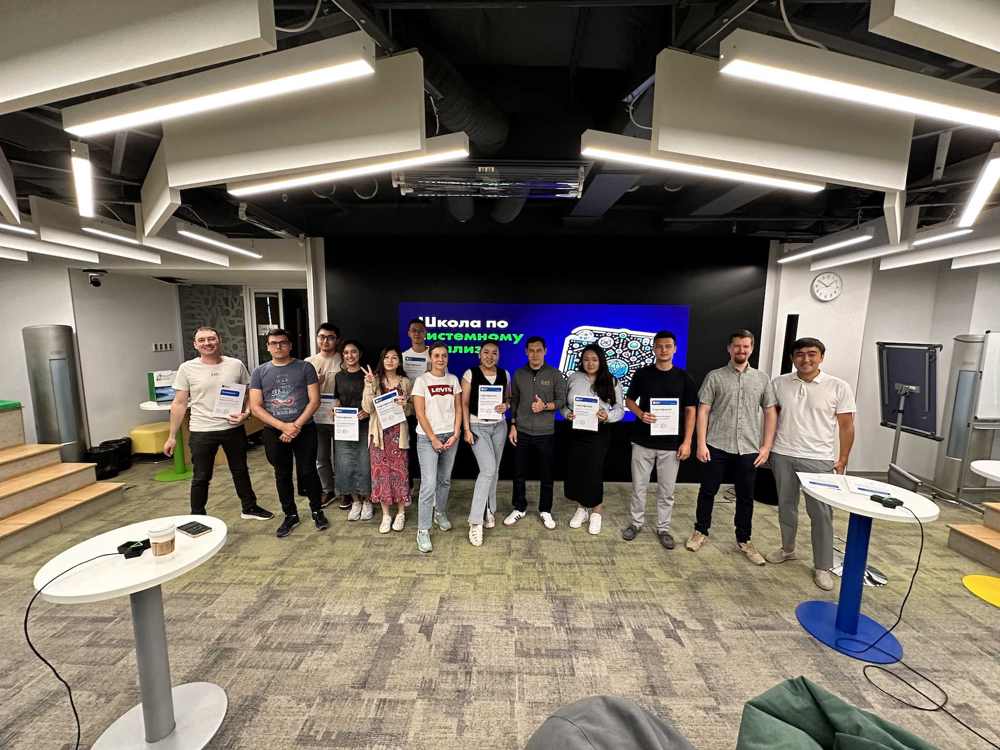
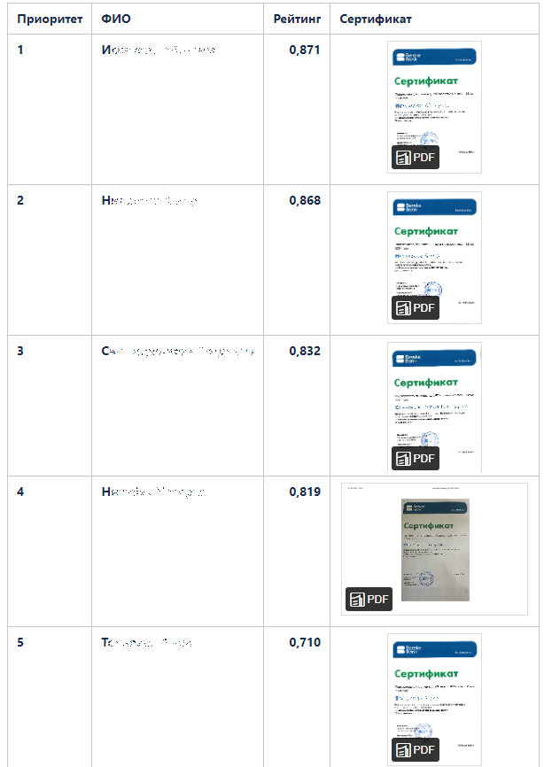

## Начало

В начале 2024 года перед нашей командой встала амбициозная цель - запустить школу SA на площадке банка, насущным стал вопрос с чего начать и далее в детали:

*   Кого обучать
*   Сколько учеников обучать
*   Как подбирать людей
*   Какой формат обучения сделать
*   Какой должна быть программа обучения
*   Кто будет преподавать
*   Какой календарный план составить
*   Какие домашние задания придумать
*   Какую систему оценки использовать
*   Как проверить усвоение знаний в результате обучения
*   Что делать с выпускниками

Эти вопросы предстояло оперативно решать, т.к. дата запуска школы была назначена на начало апреля этого года. В первую очередь наша команда проработала программу обучения, включая какие темы преподавать в школе, кто будет преподавать. Для этих целей лучше подходили квалифицированные кадры с богатым опытом работы в крупных компаниях, на проектах с полным набором функциональных ролей с практическим пониманием SDLC при работе в гибких методологиях.. 

  

### Преподаватели

Команда преподавателей была сформирована из сотрудников банка и экспертов нескольких функциональных направлений трудоустроенных в т.ч. недавно в 2023 году, а так же внештатных сотрудников предоставляемых на площадку банка компаниями партнеров. В результате в качестве преподавателей и менторов изъявили желание участвовать сотрудники банка представители нескольких стран СНГ: эксперты в области UX\\UI, solution архитектуры, продуктового менеджмента и системного анализа. Непосредственное участие в запуске школы принимали 17 сотрудников компании.

  

### Набор

Набор на первый поток обучения в школу SA открыли в начале марта и длился он 18 дней, вплоть до праздника весны Наурыз, за это время было заполнено 128 анкет желающими принять участие в обучении, предстояла работа по подбору учеников в группу обучения первого потока.

Отбор кандидатов в ученики на первый поток состоял из двух этапов:
				  

*   Анкетирование 
*   Интервью

#### Анкетирование

Набор кандидатов желающих обучиться на новую профессию решено было производить посредством инструмента google формы. Составленный опросник из 25 вопросов включал вопросы закрытого, открытого типа, с одним вариантом ответа и множеством, а так же кандидатам требовалось пройти DISC тестирование и вложить результаты в виде ссылки на результат, по тематике можно разделить вопросы на следующие категории:  
* вопросы общего характера, среди которых действующая функциональная роль и занимаемая позиция  
* на уровень знакомства с IT тематикой  
* вопросы на проверку soft skills  
* вопросы на логику и кейсы на проверку критического мышления и дедукции  
* вопросы по мотивации, чем руководствуется кандидат подающий заявку на обучение

**По ограничениям:**
  
* Школа рассчитана на желающих из числа сотрудников банка, кроме уже действующих SA, т.к. программа курса включает базовую подготовку и сотрудники трудоустроенные в банке уже используют эти знания на практике в повседневной работе.  
* В виду большого количества кандидатов первичный отбор был тщательным для формирования списка на проведение первичного интервью и утверждения кандидата в группу учащихся на первый поток.

#### Первичное интервью

На интервью отводилось 30-60 минут, подготовленный опросник состоял 13 вопроcов, следующей тематики:

* Жизненный путь
* Кейсы на анализ (систематизация)
* Кейсы на soft skills

Интервью состояло из открытых вопросов и практических кейсов синтетических на систематизацию и жизненных из профессиональной деятельности на проверку soft skills, дополнительно на интервью проверялось соответствие с результатами DISC тестирования, результаты которого использовались из этапа анкетирования на участие в школе.

  

## Программа обучения

Программа обучения состояла из следующих разделов:

* Основы бизнес процесса разработки ПО
* Методологии (гибкие, "жесткие" и их особенности)
* Инструменты (основной инструментарий применяющийся SA на площадке банка)
* Основы бизнес анализа в SDLC
* Требования (разновидности, техники извлечения)
* Коммуникации в работе аналитика
* Цикл работы с требованиями
* Архитектура (разновидности архитектуры построения информационных систем)
* Проектирование UI
* Моделирование диаграмм (UML)
* Моделирование бизнес процессов (BPMN)
* Базы данных
* Интеграции (API, sync\\async)
* Документы, шаблоны (итоги с примерами из реальных проектов)

  
Программа обучения была сформирована не случайно, программа в первую очередь соответствовала потребностям банка, а так же принятым стандартам в рамках центров компетенций и функциональном направлении SA. Подача происходила в комплексе для формирования кругозора у учащихся для понимания масштаба необходимых знаний для входа в профессию системного анализа. Нужно понимать, что за столь короткое время обучения, тяжело дать углубленные знания, которых бы хватило для самостоятельной работы, но как известно теория без закрепления и использования на практике может так и оставаться теорией, а далее забываться. Поэтому далее внимание было уделено практическим заданиям.

### Продолжительность и календарный план по школе:

Начало занятий по первому потоку стартовало 2 апреля 2024 года и проходило до 30 мая включительно по 2 занятия в неделю с переносами при выпадении занятий на праздничные дни.  
В июне уже проводились дополнительные активности по завершению школы, включая награждение которое состоялось 20 июня, где вручались сертификаты участникам школы, сертификаты соответствия требованиям на junior грейд SA успешно сдавшим экзамен и грамоты благодарности преподавателям школы, благодаря вовлеченности и энтузиазма которых запуск школы стал возможен. Награждение производил Управляющий директор по развитию технологий АО «Bereke Bank» Валеев Рафаэль.

#### Распорядок занятий:

Обучение происходило в рабочие дни по вторникам и четвергам, продолжительность занятия 2 часа, время проведения с 17:00 до 19:00 (GMT + 5) с учетом секций вопросов и интерактивного взаимодействия преподавателя с учениками.  

Время проведения было выбрано не случайно, вы можете подумать, а как же рабочий день? но ответьте себе на вопрос, как на работу глобально может повлиять отсутствие сотрудника на рабочем месте в течении 2х часов в неделю... кто-то проводит за чаем\кофе гораздо больше времени, ну здесь не о предпочтениях сотрудников, а о внимании и интересе со стороны банка, когда банк инвестирует 1 час рабочего времени в сотрудника и его обучение и развитие и сотрудник инвестирует 1 час свободного времени, создается паритет и мотивация в обучении увеличивается, а кто пришел отсидеть рабочее время на обучении уже не захочет тратить час персонального времени если не мотивирован на получение знаний и развитие. Таких учеников сразу будет видно, а регулярное присутствие на половине занятий и пропуски в отдельно взятые дни, даже при наличии материалов и записей обучения таким людям увы не интересно развиваться или они попали на обучение случайно, но для этого применяется анкетирование и интервью, чтобы максимально отсеять не горящие глаза.

Дополнительные активности:  					
* Вводное занятие  
* Тестирование по всему курсу обучения  
* Защита артефактов сквозного домашнего задания - командами  
* Экзамен в формате технического интервью - индивидуально  
* Награждение выпускников и участников школы по завершению первого потока

### Практические задания:

Путем коллективного обсуждения по формату обучения было решено делать групповые практические задания, т.к. это позволяет с эмулировать работу в реальных командах аналитиками, когда при обсуждении фичей и груммингах происходит мозговой штурм и прорабатываются варианты реализации обсуждаются нюансы и предложения, к посчитали, что работа в группах над домашними заданиями позволит коллегам практиковать софт скиллы, попробовать себя в качестве лидера группы и сразу получить возможность увидеть свои или чужие ошибки, т.к. одна голова хорошо, а две и больше это мутант... шутка.   
Тематика домашнего задания была выбрана из бытовой повседневной жизни, дабы облегчить погружение учениками в предметную область и контекст потребности бизнеса, по выходу заведения общественного питания на канал дистанционного обслуживания, как можно уже догадаться многими любимые сервисы доставки еды, но в контексте семейного заведения, без использования существующих агрегаторов, тематика имела сквозной характер и по мере прохождения обучения, учащиеся формировали отдельные элементы и артефакты, которые по итогу превратились в документацию в результате обучения, которую далее команды защищали коллективно у экзаменаторов, отстаивая выбранные варианты реализации, приводя аргументы и описывая нюансы и выбор путей решения, попутно получая обратную связь по сильным и слабым сторонам выполненной работы. Защита артефактов учащимися была отдельным интерактивным занятием, защита каждой группой производилась в удобное участникам группы время и отдельно для каждой группы, т.к. проблематично в один момент уделить должное внимание сразу 5 группам, с обильным объемом документации в результате выполнения практических заданий школы. На защиту каждой группе выделялся 1 час.  

  

### Система оценки

Как оценивать учащихся, задача учесть ряд факторов влияющих на результат обучения в совокупности, среди которых:

*   Посещаемость занятий, т.к. важно, чтобы люди посещали занятия, задавали вопросы по ходу обучения и участвовали в живом взаимодействии на обучении для лучшего усвоения знаний.
*   Результаты промежуточного тестирования, по итогам некоторых занятий формировались тесты для закрепления знаний.
*   выполнения практических домашних заданий финального тестирования по всему курсу обучения защиты итоговой документации по сквозному домашнему заданию
*   финального экзамена для подтверждения знаний на junior системного аналитика. (в формате технического интервью по программе обучения и практическими кейсами)

  
Шкала оценки выбрана 5-ти бальная с %% представлением, для получения точного финального рейтинга учащихся по результатам обучения в школе.  
Данный рейтинг принято было использовать для дальнейшего продвижения молодых специалистов через HR подразделение банка в команды по направлениям бизнеса которым будут требоваться системные аналитики на грейд junior. 

Примечание: Предпочтение отдавалось командам, где уже представлена функциональная роль системного аналитика middle, senior грейда, т.к. очевидно, что для самостоятельной работы выпускникам предстояло пройти сложный путь проб и ошибок и им требовался наставник, кто смог бы их направлять, поправлять и быть источником знаний на конкретном домене и в предметной области.

Для оценки финального рейтинга сформирована формула, где доля от общего результата выполнения домашних заданий и всех этапов обучения по школе в совокупности составляли бы 50% веса итоговой оценки по обучению и финальный экзамен в формате технического интервью еще 50%.

### Экзамен

Планировался и проводился индивидуально, в формате технического интервью, по сути аналог интервью кандидатов с улицы. но с поправкой на грейд и программу обучения, на экзамен выделялось полтора часа. После экзаменов среди допущенных равнодушных не осталось, т.к. учащиеся получили свой первый подобный опыт технического интервью и осознали, что ждет их на реальном интервью, если они захотят попробовать свои силы на рынке. 

  

## Наши итоги по первому потоку:

Анкет обработано: 128  
Проведено отборочных интервью: 28 из них одобрено на поток 20  
Сформировано 5 групп по 4 человека (формирование групп происходило с учетом балансировки по результатам DISC тестирования)  
Допущены к экзаменам: 14 из 20  
Успешно сдали экзамен: 5 из 14  
На момент 01.09.2024 трудоустроено: 4 из 5 выпускников

В результате обучения 5 из 20 учеников успешно сдали экзамен и подтвердили свой уровень знаний на junior грейд системного аналитика получив соответствующий сертификат школы SA АО «Bereke Bank», среди которых:  

* менеджер по релизам  
* сотрудник техподдержки  
* сотрудник HR  
* бизнес аналитик  
* тестировщик (QA manual)  
и др.

Материалы обучения по школе SA сохранены в записи и доступны для желающих сотрудников банка в рамках повышения собственной квалификации в формате самообучения и при желании смены направления деятельности и проверки сил в новой функциональной роли, либо при желании помогать внутри команды действующему SA, даже если ему не нужна помощь :)

  
### Что делать с выпускниками

HR подразделение получило инструкции и рейтинг выпускников школы для рекомендации обучившихся в команды банка, при обращении за наймом новых сотрудников на функциональную роль SA, в первую очередь смотрели кандидатов внутри банка, а именно выпускников в порядке убывания рейтинга.

Скрин рейтинга

  

## PS

Позитивные итоги по проведению школы SA это результат усилий всех ее участников и командной работы, среди которых: преподаватели, менторы, HR представители, руководство банка и лидеры центра компетенций по системному анализу. Это в первую очередь вклад в развитие сообщества SA и IT направления АО «Bereke Bank» и на рынке в целом.

  

### Использованные решения для проведения школы SA:

* Zoom  
* Telegram  
* google classroom  
* Atlassian  
	* confluence  
	* jira  
* Camunda modeler  
* [draw.io](http://draw.io/)\\[diagrams.net](http://diagrams.net/)  
* PlantUML  
* [swagger.io](http://swagger.io/)  
* [dbeaver.io](http://dbeaver.io/)  
* VS code  
а так же макросы confluence позволяющие моделировать, импортировать смоделированные схемы и диаграммы
