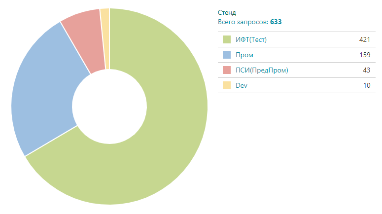
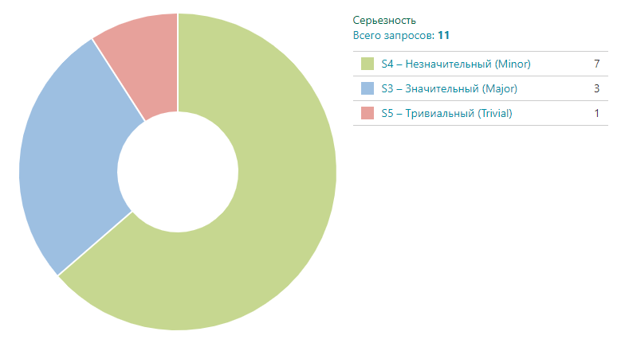
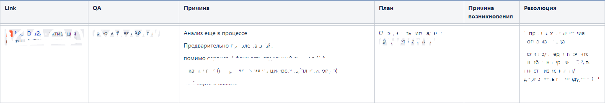
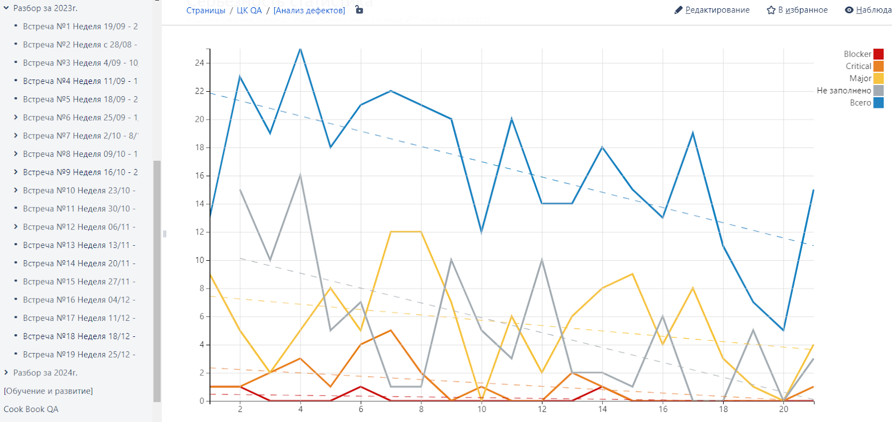

# Инженерные практики разработчиков Bereke Bank

- [Инженерные практики QA специалистов Bereke Bank](#инженерные-практики-qa-специалистов-bereke-bank)
  - [Дефект анализ](#дефект-анализ)
- [Инженерные практики Frontend разработчиков Bereke Bank](#инженерные-практики-frontend-разработчиков-bereke-bank)
  - [Обновление библиотек](#обновление-библиотек)
  - [Линтеры и форматтеры](#линтеры-и-форматтеры)
  - [Тесты](#тесты)
  - [Сборка](#сборка)
  - [Качество кода](#качество-кода)
  - [Коммиты](#коммиты)
- [Инженерные практики Backend разработчиков Bereke Bank](#инженерные-практики-backend-разработчиков-bereke-bank)
  - [Архитектура проектов](#архитектура-проектов)
  - [Библиотеки и артефакты](#библиотеки-и-артефакты)
  - [Тестирование сервисов](#тестирование-сервисов)
  - [Качество кода](#качество-кода)
  - [Code Review](#code-review)
- [Архитектурные практики Bereke Bank](#архитектурные-практики-bereke-bank)
  - [Архитектурный комитет (АКИТ)](#архитектурный-комитет-акит)
  - [Архитектурный круг](#архитектурный-круг)

## Инженерные практики QA специалистов Bereke Bank

- [Дефект анализ](#Дефект-анализ)

### Дефект анализ

«Одной из ключевых задач QA является выявление и исправление дефектов в процессе разработки и тестирования. В данном разделе мы обсудим способы определения и анализа неудач в работе QA, а также методы и метрики для их оценки.

Начнем из основной метрики для оценки эффективности работы QA - это  соотношение количества дефектов на Промышленной среде к Тестовым средам (Пром/Тест). Например, как вы видите на графике  25% дефектов выявлено на Промышленной среде, в то время как оптимальное соотношение составляет 15% на 85% Пром/Тест, что говорит о наличии проблем в процессе управления дефектами и о необходимости мероприятии по улучшению данного показателя

Мероприятия по улучшению: Для улучшения ситуации были проведены мероприятия, направленные на выявление и решение слабых мест в тестировании. Одним из таких мероприятий стали **еженедельные встречи по анализу дефектов**. Данные встречи проводятся с целью минимизации рисков повторного возникновения дефектов и выявления проблемных зон в процессах и командах.

**Процесс анализа дефектов**: Процесс анализа дефектов включает сбор информации о дефектах из Промышленной среды, их классификацию по степени серьезности и анализ причин их возникновения. Эта практика позволяет более эффективно управлять дефектами и предотвращать их повторное возникновение. У нас этот процесс  выглядит следующим образом:

1. Фильтрами в Jira, раз в неделю, собираются дефекты. Анализируем только дефекты из  промышленной среды. Разбиваем по серьезности. 

2. Следующим шагом оповещаются команды о готовности дашборда, далее все QA причастные к дефектам начинают работу по сбору и анализу причин возникновения.

3. В Confluence создается страница в которую переносятся дефекты с уровнем критичности от Major и выше.

4. Далее QA самостоятельно, либо во время встречи, заполняет соответствующие колонки.

5. Если дефект пропущен из за недостаточности тестового покрытия, либо неучтенных проверках, заводится поручение, описывающее дальнейшие действия QA для предотвращения подобных дефектов в будущем.

С помощью данного процесса нам удалось снизить количество дефектов на промышленной среде до 12%.

Также при анализе мы использовали практику  классификации дефектов:

**Дубли.** Попадались 2-3 одинаковых бага от разных авторов. Проблема решалась отклонением всех дефектов кроме того что взят в работу.

**Инциденты.** К ним относим уникальные ошибки, сложные к воспроизведению и ошибки не относящиеся к QA, например ошибки инфраструктуры.

1. **Доработки или Заявки на развитие.** Часто встречаются доработки, заведенные, как дефекты. Тут в корневых причинах человеческий фактор, в основном невнимательность при заведении задач в Jira. Подобное решается достаточно легко, изменением типа задачи.

**Дефекты.** Непосредственно баги пропущенные во время тестирования. По ним ведется основная аналитическая работа и назначаются поручения.

**Дефекты мотыльки** которые продолжительное время висят в статусе “Зарегистрировано”, нет назначенного исполнителя, заполнены не по правилам, либо не содержат никакой информации и описания ошибки нещадно отклоняются. Подобную чистку проводим раз в месяц. Вы не поверите, еще ни разу, ни кто, не обратился с просьбой о восстановлении подобных задач.

Эта классификация позволяет более точно анализировать природу и причины возникновения дефектов, что в свою очередь способствует принятию соответствующих мер по их исправлению

В результате фокусируемся на важном, отсекая ненужное. И получаем новую метрику

На графике собраны дефекты в динамике, по неделям, в разрезе критичности. Основные показатели для анализа: линия тренда, пики и плато в показателях. Соответственно посмотреть, что же происходило в аномальных точках можно как в Jira на графиках, так и в конфлюенсе.

Итоги: В результате проведенных мероприятий удалось повысить культуру работы с дефектами, выявить проблемные места в тестировании, сосредоточиться на важных задачах и оптимизировать бэклоги. Эти усовершенствования позволили улучшить качество программного продукта и повысить удовлетворенность клиентов.

## Инженерные практики Frontend разработчиков Bereke Bank

В этом разделе мы расскажем, как мы работаем с кодом и окружением в клане Web Chapter в Bereke Bank. Мы стараемся быть в курсе последних тенденций в индустрии и применять их в своей работе, при этом не забывая о том, что мы работаем в банке и наша работа должна быть безопасной и надежной.

### Содержание

- [Обновление библиотек](#Обновление-библиотек)
- [Линтеры и форматтеры](#Линтеры-и-форматтеры)
- [Тесты](#Тесты)
- [Сборка](#Сборка)
- [Качество кода](#Качество-кода)
- [Коммиты](#Коммиты)

#### Обновление библиотек

Все библиотеки, которые мы используем в наших проектах, должны быть обновлены до последней версии. Это позволяет нам использовать последние фичи и исправления, а также улучшает безопасность и производительность наших приложений.

Для обновления библиотек мы используем npm-check, yarn upgrade и другие инструменты, которые позволяют автоматизировать процесс обновления.

#### Линтеры и форматтеры

В работе мы используем ESLint и Prettier. Эти инструменты позволяют нам поддерживать единый стиль кода во всех проектах, а также выявлять потенциальные ошибки и проблемы в коде.

У нас есть общий конфиг для ESLint, который мы используем во всех проектах. В нем мы подключаем плагины для проверки типов, React, React Hooks, Jest и другие. Также мы подключаем правила для TypeScript, чтобы не упустить ошибки в типах.

Для форматирования кода мы используем Prettier. Это позволяет нам не тратить время на форматирование кода и не спорить о том, какой стиль лучше. Все файлы форматируются автоматически при коммите / сохранении файла.

#### Тесты

Все приложения, которые мы разрабатываем, должны быть покрыты тестами. Это позволяет нам убедиться, что приложение работает корректно, а также не допустить регрессий при внесении изменений.

Соблюдая пирамиду тестирования, мы пишем как unit-тесты, так и интеграционные тесты. Для unit-тестов мы используем Jest и vitest, а для интеграционных тестов — Cypress.

Центр Компетенций QA помогает нам внедрять тестирование в наши проекты. Они проводят обучения и консультации, а также отвечают за ручное тестирование и автоматизацию тестирования.

#### Сборка

В разных проектах Банка мы используем разные инструменты для сборки. В основном это Webpack и Vite (Rollup).

#### Качество кода

Для проверки качества кода мы используем SonarQube. Это позволяет нам выявлять проблемы в коде и улучшать его качество.

Поддержка качества кода — это задача всей команды. Каждый разработчик должен следить за тем, чтобы код, который он пишет, был чистым и понятным. Кросс-чеки и ревью помогают нам добиваться этого.

#### Коммиты

Все коммиты должны быть понятными и информативными. Коммиты должны быть написаны на английском языке и содержать информацию о том, что было сделано в этом коммите.

Мы используем Conventional Commits для структурирования коммитов. Это позволяет нам автоматизировать процесс релизов и генерировать changelog.

Атомарные коммиты помогают нам легко откатывать изменения и вносить правки в уже существующие коммиты. Это позволяет нам быстро реагировать на изменения в требованиях и улучшать качество кода.

## Инженерные практики Backend разработчиков Bereke Bank

В этом разделе мы раскажем о том, каких инжернерных практик придерживаются разработчики в ЦК Backend.

В банке backend разработка ведется на двух языках - Go и Java, однако инженерные практики остаются общими для всех.

Прежде всего мы нацелены на создание высокопроизводительных и безопасных систем и сервисов. Про новые технологии и подходы так же не забываем: разработчики пилотируют интересные им библиотеки, фреймворки, которые в дальнейшем могут стать де-факто стандартом в направлении.

### Содержание

- [Архитектура проектов](#Архитектура-проектов)
- [Библиотеки и артефакты](#Библиотеки-и-артефакты)
- [Тестирование сервисов](#Тестирование-сервисов)
- [Качество кода](#Качество-кода-)
- [Code Review](#code-review)

#### Архитектура проектов

Для всех проектов на Go и Java существует архитектура, описывающая то, как должен разрабатываться проект.

Это позволяет cравнять порог входа в различные сервисы Банка для разработчиков, а так же позволяет реализовать различные типовые инструменты:

- генераторы проектов
- шаблоны микросервисов
- типовые библиотеки, составляющие эко-систему

#### Библиотеки и артефакты

Все библиотеки и образы хранятся в Nexus, сборки в Harbor.

Библиотеки и образы добавляются в Nexus руками специалистов DevOps и представителей информационной безопасности. Специалисты ИБ проверяют библиотеку или образ на наличие уязвимостей и если скрининг проходит успешно, специалисты DevOps вносят новую версию библиотеки в хранилище артефактов.

Сборки помещаются в Harbor после билда и запуска unit-тестов. У каждой сборки есть свой номер, что позволяет быстро совершать накаты и откаты в OpenShift и Kubernetes.

#### Тестирование сервисов

Все сервисы, которые мы разрабатываем должны быть покрыты тестами.

Разработчики пишут unit и интеграционные тесты для своих сервисов. Тесты выполняются в пайплайнах Gitlab CI и являются обязательными для дальнейшего наката на тестовую или промышленную среду.

В командах Go разработки для unit тестов используются стандартные пакеты `testing` и `github.com/stretchr/testify/assert`. Для написания e2e тестов используется `github.com/lamoda/gonkey`.

В командах Java разработки unit-тесты пишутся с использованием инструментов Spring boot - `JUnit 4/5` и `Mockito`.

После выполнения тестов инициативу подхватывает специалист QA, который проверяет наши сервисы ручным и авто тестирование, согласно use case-ам и стандартам ЦК QA.

#### Качество кода

Качество кода - вещь субъективная. Для направлений Go и Java мы разработали check-листы для оценки качества кода, а так же утвердили code convention-ы для каждого из языков.

Мы считаем, что качественным код можно назвать, если он:
>
>- чистый (соответствующий code convention)
>- организованный и структурированный
>- тестируемый
>- поддерживаемый
>- описанный

Для команд Go разработки был принят [style гайд от Uber](https://github.com/uber-go/guide/blob/master/style.md).

В командах Java разработки придерживаются норм, устанавливаемых Spring Framework-ом.

#### Code Review

Code Review - важнейшая инженерная практика, так как выполняет две функции: контроль качества и обучение.

Для обеспечения контроля качества в рамках Code Review был выработан свод правил для его проведения. При Code Review уделяется внимание как качеству кода, так и нюансам логики, тестам.

Обучающую функцию Code Review несет для наших младших специалистов, которые по комментариям ревьюера получют ценный опыт и более плавно погружаются в нюансы корпоративных стандартов.

Среди ревьюеров Bereke Bank есть золотое правило - `"не критиковать, а предлагать"`, а так же `"оставаться профессионалом"`. Это позволяет держать планку качества code review и устраняет страх у младших специалистов.

## Архитектурные практики Bereke Bank

В настоящее время в Банке организованы две глобальные регулярные архитектурные встречи - Архитектурный комитет и Архитектурный круг. У этих органов разные цели и принципы работы, которые будут описаны ниже.

### Архитектурный комитет (АКИТ)

#### Цели и задачи

Архитектурный Комитет по Информационным Технологиям (АКИТ) создан для принятия важных архитектурных решений, существенно влияющих на ИТ-ландшафт банка. К таким решениям могут относиться внедрение новых ИС, платформ, глобальный рефакторинг или миграция, вывод ИС из эксплуатации.

#### Цели собрания

Принятие решений по выбору, закупке и внедрению новых ИТ-систем.
Утверждение Концептуальной архитектуры для ввода новых систем в эксплуатацию.
Рассмотрение других архитектурных вопросов, требующих согласования заинтересованных сторон вне ИТ Блока.

#### Участники

На собрании обязательно присутствуют представители ИТ, ИБ, Рисков, Бизнес-направлений и др., с которыми согласовываются архитектурные изменения ИТ-ландшафта. Участники могут быть постоянными или приглашенными в зависимости от рассматриваемого вопроса.

#### Частота проведения

Обычно комитет проводится каждый вторник.

#### Решения

По каждому вопросу, вынесенному на АКИТ, утверждается Решение, фиксирующее договоренности, достигнутые на встрече, а также содержащее поручения, вытекающие из обсуждения.

### Архитектурный круг

#### Цели и задачи Архитектурного круга

Архитектурный круг – это встреча в формате принятого в Банке подхода к управлению - холакратии. Его целью является обсуждение насущных архитектурных вопросов командой экспертов и рассмотрение статуса текущих задач в области архитектуры.

#### Участники Архитектурного круга

В состав постоянных участников круга входят solution и enterprise архитекторы, ИТ-бизнес партнеры, SEMы и директор Блока развития технологий. Остальные участники добавляются по необходимости в зависимости от повестки встречи.

#### Частота проведения Архитектурного круга

Встреча длится 1 час и проводится каждую пятницу. Встреча открытая, на нее может прийти любой сотрудник Банка - побыть слушателем или вынести свой вопрос на обсуждение.

#### Когда обратиться в Архитектурный круг

Если команда подозревает, что решения в проекте или продукте не совсем оптимальны с точки зрения архитектуры.

Если у команды есть сложный архитектурный вопрос, ответа на который они не нашли в документации.

Если команда хочет обсудить применение какой-то новой технологии.
