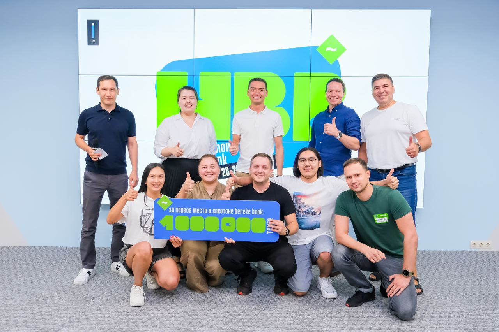

# Обучение и развитие в Bereke Bank

Поддержание актуальности знаний сотрудников для качественной работы над продуктами компании - наш приоритет, поэтому мы предоставляем всестороннее развитие и обучение. Развитием разработчиков в банке занимаются Департамент HR отдел Training & Development, DevRel и Центр Компетенций.

## Основные направления

### 1. Тренинги и тестирования

С момента подписания трудового договора, каждый сотрудник автоматически получает на корпоративной платформе тренинги об информационной безопасности и правилах работы с техникой и программами; назначается индивидуальный план развития (ИПР) в hard и soft направлениях, которые были оценены на входе. Обеспечить сохранность данных клиентов - наша обязанность. Помимо кибербезопасности, в компании проводятся тренинги на разные тематики: публичные выступления, работа в Agile, о фреймворке SAFe, искусство презентации.
орме тренинги об информационной безопасности и правилах работы с техникой и программами. Обеспечить сохранность данных клиентов - наша обязанность. Помимо кибербезопасности, в компании проводятся тренинги на разные тематики: публичные выступления, работа в Agile, о фреймворке SAFe, искусство презентации.

|  |  |
|:--:|:--:|

### 2. Митапы, хакатоны, публичные выступления

Каждые три недели по вторникам мы проводим внутренние митапы по выбранному направлению, где выступают как сотрудники, так и приглашенные эксперты ИТ рынка. Обсудили и раскрыли разное: как работает Design System, особенности работы в Cloud native, зона ответственности и боли проектных менеджеров, а также как воспитывать в себе лидера и многое другое.

|  |  |
|:--:|:--:|
|  |  |
|:--:|:--:|

Говоря о выступлениях, мы активно выходим с докладами на местных конференциях и митапах, где получаем крутейший опыт презентации на публику, так и развиваем нетворкинг.

В новом составе уже Bereke Bank-а самый крупный хакатон мы провели в июле 2023 года. Было более 120 участников и 20 команд. В этом году повторим эту практику, так как выхлоп был колоссальный — атмосфера здоровой конкуренции, генерация идей по улучшению продуктов, 20 проектов на стадии MVP.

|  |  |
|:--:|:--:|

### 3. Школы

Мы запустили внутренние школы QA, скрам мастеров, системных аналитиков. Сотрудники, желающие перейти в ИТ подразделение, получают знания и шанс перейти на новую роль. На сегодняшний день у нас 35 выпускников школ. Планируем запустить еще 4 школы.

3 апреля 2024 года был завершен СХ Акселератор на тему “Клиентоцентричная разработка продуктов: инструменты и методы”, в рамках которого, 25 выпускников презентовали свои проекты.

|  |  |
|:--:|:--:|

### 4. Курсы

На корпоративном портале мы собрали более 50 курсов по hard и soft skill-ам: на улучшения внутриличностных и межличностных проблем, а также по эффективности, нестандартному мышлению, продажам, эмоциональному интеллекту и так далее. Также мы предоставляем скидки при желании пройти внешнее обучение.

Нам важно понимать, что помогает нашим сотрудникам расти и делает их счастливыми. Мы стараемся выявлять потребности членов нашей команды и выделять ресурсы, чтобы частично или полностью их удовлетворить. Для предложений о партнерстве можете связаться с нами по почте <Dinara.Nurmukasheva@berekebank.kz> (HR lead L&D) или <Aigul.Urpekova@berekebank.kz> (DevRel).
