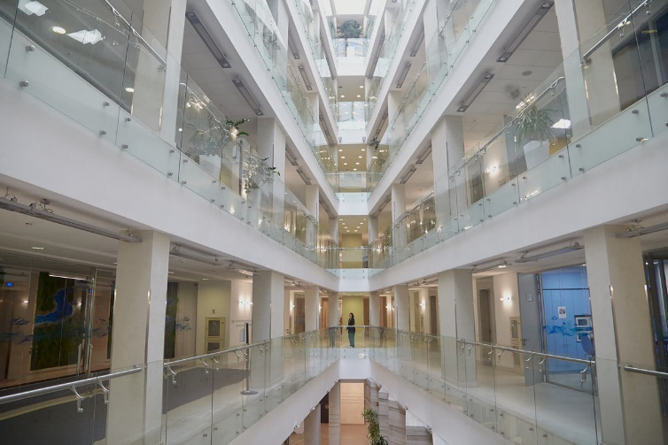
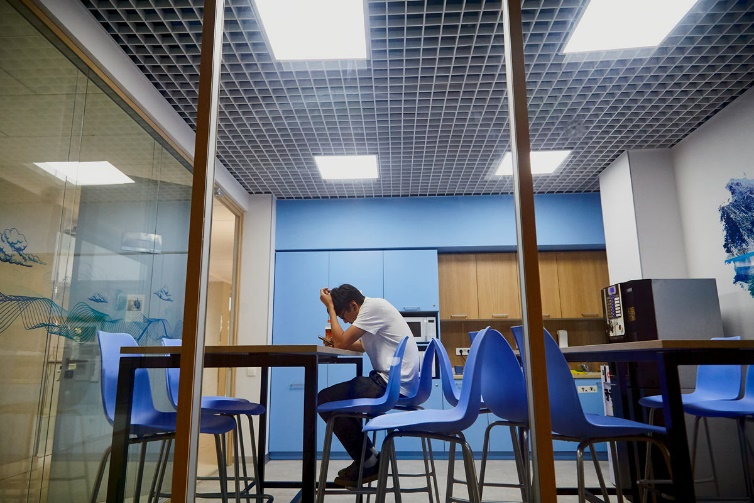
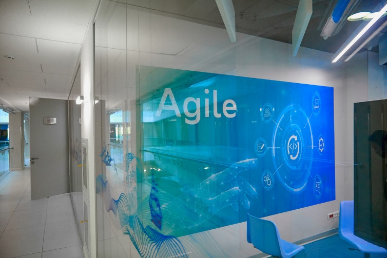
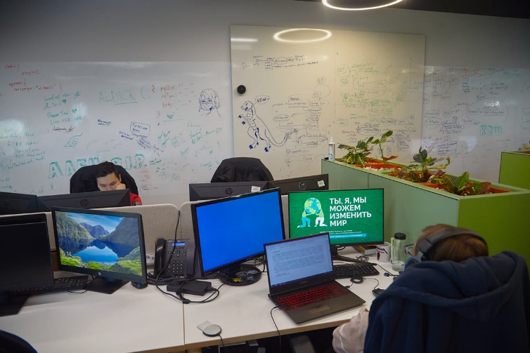
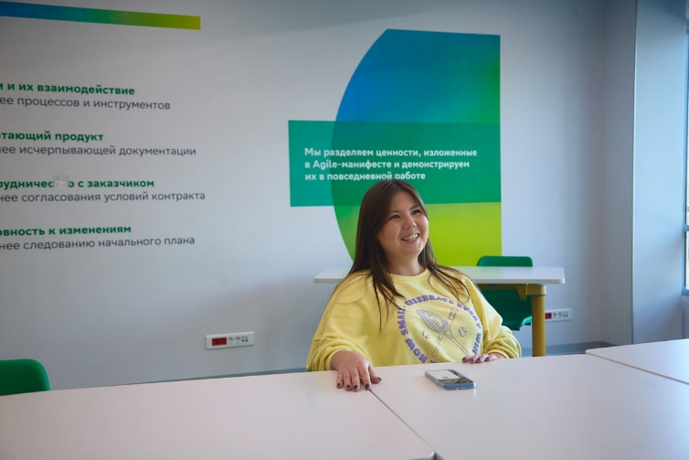
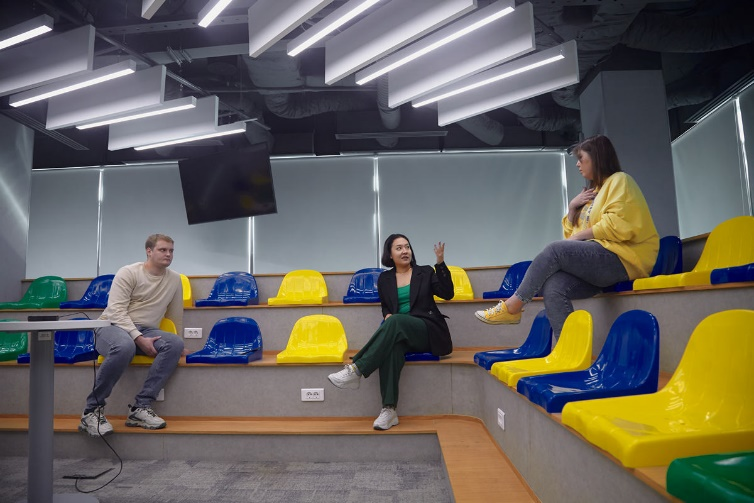
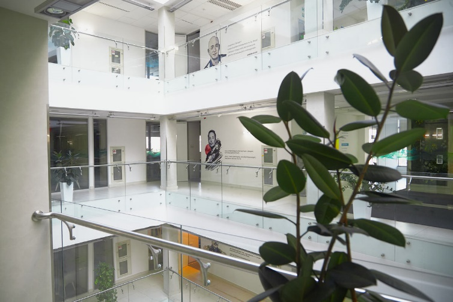
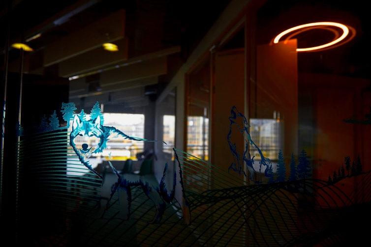

# Как проходит отбор IT-экспертов в Bereke Bank

**Все актуальные вакансии доступны по** [**следующей ссылке**](https://hh.kz/employer/1245405)**.**

Сейчас за работу сервисов и продуктов Bereke Bank отвечает внушительная команда из 350 ИТ-специалистов.

## Этапы интервью

Обычно рекрутинговый процесс в Банк происходит в 3 онлайн-этапа через Zoom или Google Meet.

### Этап 1. Первичное интервью c IT-рекрутером

В рамках данного этапа рекрутер уточняет ожидания кандидата от работы в Bereke Bank, мотивацию и совпадения по культурным ценностям. Кандидату также задают небольшое количество вопросов на знание теории и практики в соответствии с профилем вакансии. Собеседование длится 30-40 минут.

### Этап 2. Техническое интервью

По каждому направлению в IT у нас есть технические лидеры, которые проводят собеседования согласно матрицам компетенций в формате вопроса-ответа и решения кейсовых заданий. Продолжительность интервью - 60-90 минут.

По итогам собеседования наш технический специалист даёт оценку кандидату.

Успешных соискателей мы приглашаем на следующий этап — собеседование с руководителем. Соискателям, не прошедшим первый этап отбора, мы даём обратную связь и рекомендации по тому, какие профессиональные навыки стоит подтянуть.

### Этап 3. Интервью с руководителем

На финальной встрече нанимающий руководитель описывает кандидату, чем занимается команда, конкретные рабочие задачи и как устроены процессы. Мы оцениваем, насколько кандидату комфортно с потенциальными коллегами, интересны ли ему задачи, соответствуют ли его взгляды нашим ценностям и культуре.

Продолжительность интервью примерно 30-45 минут.

### Подготовка оффера

Успешные кандидаты получают оффер от Банка, который запускается через систему ЭДО и весь процесс занимает буквально 1-2 дня.

### Кандидаты, не прошедшие отбор

Не прошедшим отбор кандидатам мы обязательно даём обратную связь и рекомендации. Соискатели, не прошедшие техническое собеседование, могут через 6 месяцев снова попробовать свои силы, либо рекрутеры могут сразу предложить им другие подходящие вакансии.

### Бонусы

- ДМС со стоматологией, компенсацией на спорт и лекарства
- Бесплатный доступ к онлайн-библиотеке «My Book»
- Отсутствие дресс-кода
- Гибридный/удаленный формат работы
- Льготное залоговое кредитование
- Корпоративная сотовая связь

### Офис Bereke Bank в БЦ “Q”

**У Bereke Bank 18 филиалов по всему Казахстану, не считая отделений и центров обслуживания клиентов (их больше 50). В каждом из них есть свои айтишники — специалисты поддержки, которые отвечают за постоянное функционирование банковской инфраструктуры. Но, основная локация ИТ-специалистов находится в бизнес-центре «Q» в Алматы.**

**“Q”** — бизнес-центр класса «А» - «Q», расположенный в деловом центре Алматы по адресу: ул. Желтоксан, 191.

Мы занимаем три этажа бизнес-центра со 2-го по 5-ый. Каждый этаж имеет одинаковую планировку и включает в себя опен-спейсы для сотрудников, переговорные комнаты, кухонные зоны, митинг-румы для общих собраний, места для отдыха и уборные помещения. Единственное, чем отличаются этажи, — это оформление.

Первое, что бросается в глаза, — холлы этажей. В отличие от классических офисов, здесь они кажутся просторными. Все благодаря естественному свету, который проникает внутрь здания сверху. Ты чувствуешь себя комфортно.

На каждом этаже Bereke Bank есть разные изображения и цитаты про agile-культуру, мотивацию и личностный рост. Вот, например, фразы основателя Amazon Джеффа Безоса или гендиректора SpaceX и Tesla Илона Маска.

В распоряжении сотрудников есть Agile-зона, которая называется «Jailau». Здесь — несколько десятков кресел, офисные доски и проектор с изображением на всю стену. Помещение предназначено для обсуждения стратегических задач и планирования работы команд.

Сотрудники всегда могут свободно выбрать удобный формат работы — удалённый, гибридный или офисный. Мы обеспечиваем сотрудников всей необходимой техникой для удалённой работы, выдаём доступ к софту для продуктивного взаимодействия в команде.

| | | |
|---|---|---|
|  |  |  |
|  |  |  |
|  |  | |
